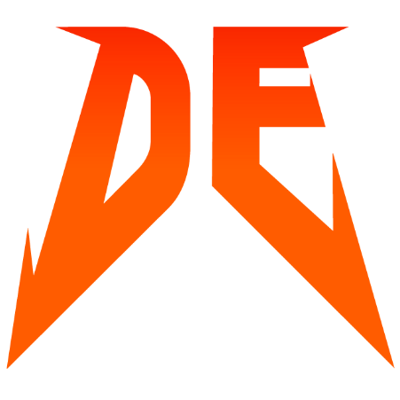

#  DE or DIE Meetups

_DE or DIE – митап, сделанный дата инженерами для дата инженеров._

Новые мероприятия: <https://deordie.timepad.ru/events/>  
Присоединяйтесь к нам в Telegram: <https://t.me/deordie_chat>  
Видео и трансляции митапов доступны на нашем канале <https://www.youtube.com/c/deordie>.

## Прошедшие мероприятия

- [DE or DIE #6](meetups/06)  
  - Иван Трусов — Delta Lake — table format for large scale storage and analytics
  - Паша Финкельштейн — Love to Frankenstein’s monster: Kotlin for Apache Spark

- [DE or DIE #5](meetups/05)  
  - Андрей Титов — Использование Scala UDF в PySpark
  - Дмитрий Шалин — Мой первый Data Lake

- [DE or DIE #4](meetups/04)  
  - Артем Селезнев — Своя песочница – как сделать кластер для инженера данных
  - Андрей Вихров — Data governance – что это, зачем, и с чего начать

- [DE or DIE #3](meetups/03)  
  - Ксения Томак, Дарья Буланова, Михаил Кумачев, Иван Трусов — Разбор реального проекта: E2E пайплайн для прогнозирования закупок ингредиентов в пиццериях c помощью Spark Streaming

- [DE or DIE #2](meetups/02)  
  - Егор Матешук — Обзор Lambda- и Kappa-архитектур
  - Денис Хуртин — Как устроена платформа управления данными в Яндекс.Маркет

- [DE or DIE #1](meetups/01)  
  - Николай Марков — Какие дата инженеры бывают и чего от них все хотят
  - Евгений Ермаков — Что под капотом у Яндекс.Такси

## Наши партнеры

[![dp_logo]][dp_link]
&emsp;&emsp;&emsp;
[![jb_logo]][jb_link]
&emsp;
[![lm_logo]][lm_link]

[dp_link]: https://dodopizza.dev/ "Dodo Pizza Engineering"
[dp_logo]: images/dodopizza_partner.png "Dodo Pizza Engineering"
[jb_link]: https://www.jetbrains.com/ "JetBrains"
[jb_logo]: images/jetbrains_partner.png "JetBrains"
[lm_link]: https://tech.leroymerlin.ru/ "Leroy Merlin"
[lm_logo]: images/leroy_merlin_partner.png "Leroy Merlin"
